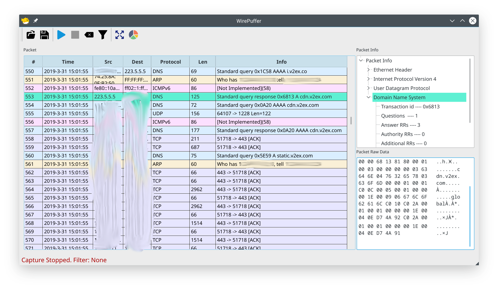

# wirepuffer


It is a stupid packet sniffer written in `C++`. It uses `libpcap`, a packet capture and filtering library and `QT5`, a popular GUI library.

Keep updating and prepared for clean slate code refactoring anytime...

## Features

- packet capture, filtering and parsing.
- can parse common protocols: `Ethernet, ARP, IP, IPv6, TCP, UDP, ICMP, ICMPv6`. Not all type of messages for a specific protocol are supported now.
- provide a typical GUI


## Dependencies

- libpcap
- Qt 5

## Build & Run

```
qmake
make
sudo ./wirepuffer
```

## Screenshot



## Why reinventing the wheel again?

I wrote it because packet sniffer with GUI may be a good toy project for beginners who want to understand network protocols if one parses raw data himself.

其实并没有，只是为了交作业...
